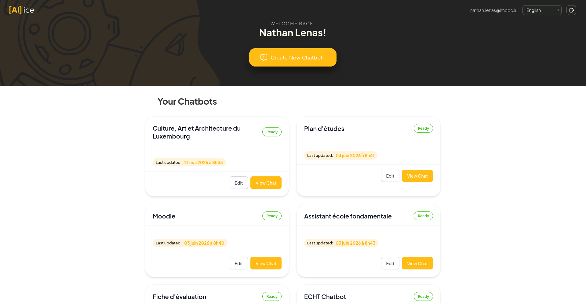
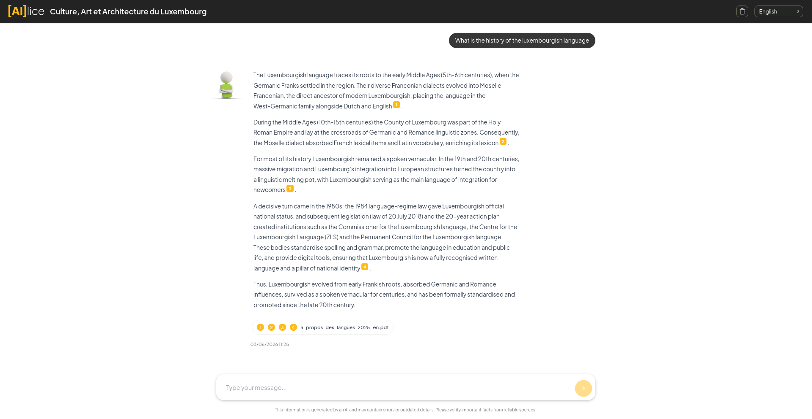

# Alice

Alice is a tool to create educational chatbots grounded in knowledge bases
assembled from course materials: uploaded documents (PDF, DOCX, PPTX, H5P,
images, plain text) and content synced from Moodle. These are served
through a RAG pipeline so learners can ask questions and get answers tied
back to the source.

## How it works

**Educators** log in via OIDC, create a chatbot, pick a persona, and attach
a knowledge base by uploading files or syncing a Moodle course. They then
share the chatbot via a URL (public, password-protected, or SSO-only).

**Learners** open the URL and chat. Each answer is grounded in the
knowledge base and returned with citations to the source documents.

*Educators manage all their chatbots from a single dashboard.*

*Learners chat with the bot and get answers grounded in the course materials, with citations.*

## Guides

- [How to install and run Alice](guides/installation.md)
- [How to create a custom persona for your Alice chatbot](guides/custom-persona.md)
- [How to setup content synchronisation between Alice and Moodle](guides/moodle-sync.md)
- [How to query an Alice chatbot from your own RAG application](guides/api-access.md)

## Licence

This project is licensed under the GNU AFFERO GENERAL PUBLIC LICENSE Version 3, 19 November 2007, you may obtain the source code on [Github](). Please check the CREDITS.md file at the root of the repository for more details about the licences and contributors.

---

Created by [LMDDC](https://lmddc.lu).
